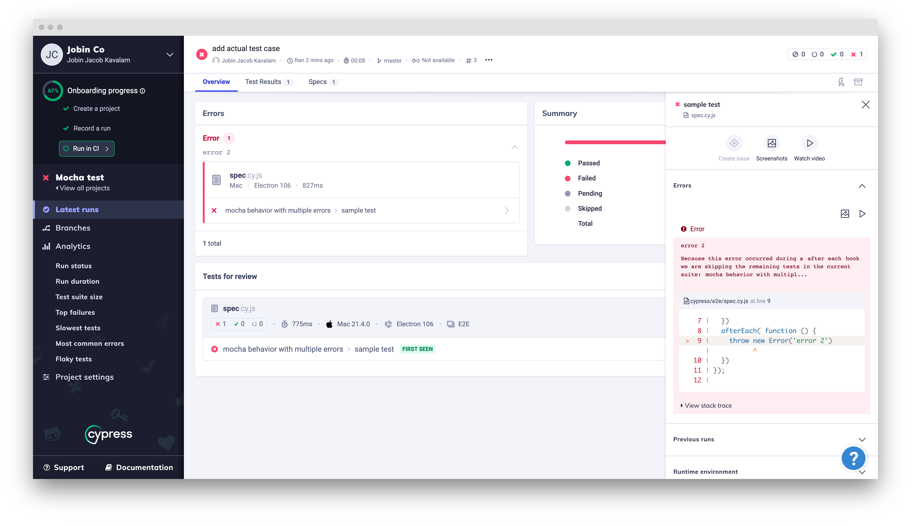

# cypress-test-tiny

Bug: Cypress dashboard does not report all the errors.

How to reproduce:

Following test (`cypress/e2e/spec.cy.js`) throws 2 errors. Both are reported in the console output.
But the dashboard only reports one of them.

```js
describe('mocha behavior with multiple errors', function () {
  beforeEach(function () {
    throw new Error('error 1')
  })
  it('sample test', function () {

  })
  afterEach( function () {
    throw new Error('error 2')
  })
});
```

```
~/jjkavalam/cypress-bug-report-1 % cypress run --record --key (redacted)

====================================================================================================

  (Run Starting)

  ┌────────────────────────────────────────────────────────────────────────────────────────────────┐
  │ Cypress:        11.1.0                                                                         │
  │ Browser:        Electron 106 (headless)                                                        │
  │ Node Version:   v14.14.0 (/Users/jobin.kavalam/.volta/tools/image/node/14.14.0/bin/node)[0m       │
  │                 [39m                                                                           │
  │ Specs:          1 found (spec.cy.js)                                                           │
  │ Searched:       cypress/e2e/**/*.cy.{js,jsx,ts,tsx}                                            │
  │ Params:         Tag: false, Group: false, Parallel: false                                      │
  │ Run URL:        https://dashboard.cypress.io/projects/wnkmbr/runs/3                            │
  └────────────────────────────────────────────────────────────────────────────────────────────────┘


────────────────────────────────────────────────────────────────────────────────────────────────────
                                                                                                    
  Running:  spec.cy.js                                                                      (1 of 1)
  Estimated: 2 seconds


  mocha behavior with multiple errors
    1) "before each" hook for "sample test"
    2) "after each" hook for "sample test"


  0 passing (829ms)
  2 failing

  1) mocha behavior with multiple errors
       "before each" hook for "sample test":
     Error: error 1

Because this error occurred during a `before each` hook we are skipping the remaining tests in the current suite: `mocha behavior with multipl...`
      at Context.eval (webpack:///./cypress/e2e/spec.cy.js:3:10)

  2) mocha behavior with multiple errors
       "after each" hook for "sample test":
     Error: error 2

Because this error occurred during a `after each` hook we are skipping the remaining tests in the current suite: `mocha behavior with multipl...`
      at Context.eval (webpack:///./cypress/e2e/spec.cy.js:9:10)


  (Results)

  ┌────────────────────────────────────────────────────────────────────────────────────────────────┐
  │ Tests:        1                                                                                │
  │ Passing:      0                                                                                │
  │ Failing:      1                                                                                │
  │ Pending:      0                                                                                │
  │ Skipped:      0                                                                                │
  │ Screenshots:  2                                                                                │
  │ Video:        true                                                                             │
  │ Duration:     0 seconds                                                                        │
  │ Estimated:    2 seconds                                                                        │
  │ Spec Ran:     spec.cy.js                                                                       │
  └────────────────────────────────────────────────────────────────────────────────────────────────┘


  (Screenshots)

  -  /Users/jobin.kavalam/jjkavalam/cypress-bug-report-1/cypress/screenshots/spec.cy.    (2560x1440)
     js/mocha behavior with multiple errors -- sample test -- before each hook (faile               
     d).png                                                                                         
  -  /Users/jobin.kavalam/jjkavalam/cypress-bug-report-1/cypress/screenshots/spec.cy.    (2560x1440)
     js/mocha behavior with multiple errors -- sample test -- after each hook (failed               
     ).png                                                                                          


  (Video)

  -  Started processing:  Compressing to 32 CRF                                                     
  -  Finished processing: /Users/jobin.kavalam/jjkavalam/cypress-bug-report-1/cypress     (1 second)
                          /videos/spec.cy.js.mp4                                                    


  (Uploading Results)

  - Done Uploading (1/3) /Users/jobin.kavalam/jjkavalam/cypress-bug-report-1/cypress/screenshots/spec.cy.js/mocha behavior with multiple errors -- sample test -- after each hook (failed).png
  - Done Uploading (2/3) /Users/jobin.kavalam/jjkavalam/cypress-bug-report-1/cypress/videos/spec.cy.js.mp4
  - Done Uploading (3/3) /Users/jobin.kavalam/jjkavalam/cypress-bug-report-1/cypress/screenshots/spec.cy.js/mocha behavior with multiple errors -- sample test -- before each hook (failed).png

====================================================================================================

  (Run Finished)


       Spec                                              Tests  Passing  Failing  Pending  Skipped  
  ┌────────────────────────────────────────────────────────────────────────────────────────────────┐
  │ ✖  spec.cy.js                               827ms        1        -        1        -        - │
  └────────────────────────────────────────────────────────────────────────────────────────────────┘
    ✖  1 of 1 failed (100%)                     827ms        1        -        1        -        -  


───────────────────────────────────────────────────────────────────────────────────────────────────────
                                                                                                       
  Recorded Run: https://dashboard.cypress.io/projects/wnkmbr/runs/3

```


